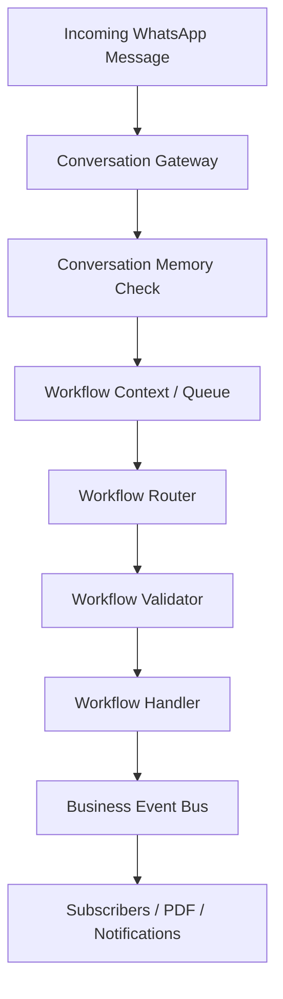

# Kredibly V3: Conversational Operating System Philosophy & Architecture

---

## 1. Vision & Core Philosophy

**Kredibly is not a chatbot. Kredibly is a Conversational Operating System (ConvOS) for small and medium businesses.**

Every interaction inside WhatsApp should feel like working with a highly capable business assistant that understands context, owns delegated tasks, remembers previous interactions, and follows work through to completion.

This philosophy is built on one core principle:
> **Once a merchant or customer delegates a task to Kreddy, Kreddy owns that task until it is completed, cancelled, or expires.**

In V3, invoicing, payments, OCR, reminders, collections, and insights are not isolated features. They are pluggable modules running on a unified conversational kernel. The goal of this architecture is to transition Kreddy from a passive parser into an active, autonomous business operator.

---

## 2. Product Experiences

Engineers implementing Kredibly code are building one of two core experiences, each with distinct goals and product requirements.

### The Merchant Experience
*   **Goal**: Eliminate administrative friction. The merchant should feel like they are talking to a dedicated business operations assistant.
*   **Key Operations**: Creating invoices, recording payments, tracking collections, extending due dates, settings alerts, and retrieving performance reviews.
*   **Dynamic**: The merchant always **delegates**. Kreddy always **executes**.

### The Customer Experience
*   **Goal**: Zero-friction payment collection. The customer should interact with a polite, automated billing assistant.
*   **Key Operations**: Receiving invoices, paying outstanding balances, requesting due date extensions, and receiving receipts.
*   **Dynamic**: The customer always **responds**. Kreddy always **resolves**.

---

## 3. The Conversational Lifecycle Blueprint

Every workflow inside Kreddy follows the exact same lifecycle. Whether creating an invoice, approving an extension, or resolving a payment matching conflict, the lifecycle is defined as follows:

```
Acknowledge ➔ Understand ➔ Confirm ➔ Execute ➔ Report ➔ Monitor ➔ Complete
```

1.  **Acknowledge**: Immediately let the sender know Kreddy received the request (e.g. template delivery confirmation or instant acknowledgment).
2.  **Understand**: Parse the request text/voice/media, resolve context, check validator schemas, and resolve memories.
3.  **Confirm**: Present a summary card and ask for explicit confirmation (using interactive buttons or confirmation synonyms).
4.  **Execute**: Commit changes to MongoDB (creating a Sale, applying payments, extending due dates).
5.  **Report**: Deliver receipts, notifications, and PDFs to the merchant, staff managers, and customers.
6.  **Monitor**: Decouple monitoring logic to run reminder escalation alerts and task schedules.
7.  **Complete**: Clear active contexts, flush transients, and return the session to `"free_conversation"` mode.

---

## 4. Architectural Pipeline

Inbound messages traverse the system through a deterministic pipeline, ensuring state safety, declarative validation, and decoupled side-effects.



### Components Walkthrough
*   **Conversation Gateway**: Intercepts inbound webhook messages, resolves number identity, and determines active session mode.
*   **Conversation Memory**: Pre-AI fact and session cache. Answers temporal recall queries ("what did I enter earlier?") before AI triggers.
*   **Workflow Context & Queue**: Holds active step names, priorities, and draft payloads. Ensures the "One Thought Rule" is maintained.
*   **Workflow Router**: Directs inputs to step-specific handlers, intercepts cancel/resume keywords, and manages transitions.
*   **Workflow Validator**: Runs validation schemas against accepted inputs (`phone`, `date`, `currency`) before the handler runs, preventing code corruption.
*   **Workflow Handler**: Implements step-specific business rules.
*   **Business Event Bus**: Emitter that publishes domain events (e.g. `InvoiceCreated`, `ExtensionApproved`).
*   **Subscribers**: Event listeners that perform async side effects (PDF generation, reminders, email receipts, Oga alerts).

---

## 5. AI vs. Deterministic Division of Labor

To remain reliable, scalable, and secure, Kredibly separates reasoning from state management.

| AI Responsibilities (Probabilistic) | System Responsibilities (Deterministic) |
| :--- | :--- |
| ✓ Understanding natural language intents | ✗ Workflow routing and step transitions |
| ✓ OCR and image interpretation | ✗ Button taps and list selection handling |
| ✓ Voice transcriptions | ✗ Input validation (phones, amounts, dates) |
| ✓ Business advice & growth insights | ✗ Payment confirmations & DB execution |
| ✓ Coherent text response generation | ✗ State persistence & session queueing |

---

## 6. The 10-Tier OS Roadmap

This roadmap organizes the development of Kredibly V3 into progressive capabilities.

```
┌─────────────────────────────────────────────────────────────┐
│                 Tier 10: AI Reasoning Layer                 │
├─────────────────────────────────────────────────────────────┤
│                 Tier 9: Recovery Engine                     │
├─────────────────────────────────────────────────────────────┤
│                 Tier 8: Business Timeline                   │
├─────────────────────────────────────────────────────────────┤
│                 Tier 7: Notification Center                 │
├─────────────────────────────────────────────────────────────┤
│                 Tier 6: Permission Engine                   │
├─────────────────────────────────────────────────────────────┤
│                 Tier 5: Confidence Engine                   │
├─────────────────────────────────────────────────────────────┤
│                 Tier 4: Workflow Analytics                  │
├─────────────────────────────────────────────────────────────┤
│                 Tier 3: Business Brain                      │
├─────────────────────────────────────────────────────────────┤
│                 Tier 2: Business Intelligence Layer         │
├─────────────────────────────────────────────────────────────┤
│                 Tier 1: Core Architecture                   │
└─────────────────────────────────────────────────────────────┘
```

### 🟢 Tier 1 — Core Architecture
Foundational layer to ensure consistent behavior across all workflows:
*   **Conversation Memory Manager**: Pre-AI lookup cache for last invoice draft, customer, payment, tasks, and recent products. Handles temporal references ("Continue that invoice", "earlier...").
*   **Response Builder**: Centrally formats all outbound WhatsApp messages. Enforces brand style, tone consistency, button rules, and the strict **No Naked Links** policy.
*   **Intent Guard**: A policy check layer between AI and execution that rejects deprecated intents (e.g. legacy payment links) and blocks invalid requests.
*   **Declarative Workflow Manifests**: Standardized step schemas specifying accepted inputs, button actions, validators, timeouts, and priorities.

### 🟢 Tier 2 — Business Intelligence Layer
Enriches raw database records into semantic merchant and customer profiles:
*   **Merchant Profile**: Tracks average invoice values, late payment rate, preferred reminder times, and collection success rates.
*   **Customer Profile**: Monitors payment history, average delay, and due date extension frequency.
*   **Risk Engine**: Assigns low, medium, or high risk scores to customers, altering collection schedules automatically.

### 🟢 Tier 3 — Business Brain
Moves from passive memory retrieval to active behavior reasoning:
*   Learns merchant habits (e.g. *"Invoices are created on Fridays"* ➔ prompts draft preparation on Thursday).
*   Adapts to customer behavior (e.g. *"Customer always pays after reminder #2"* ➔ skips reminder #1 to reduce spam).

### 🟢 Tier 4 — Workflow Analytics
Collects completion percentages, average task duration, drop-off points, and validation failure rates to highlight workflow bottlenecks.

### 🟢 Tier 5 — Confidence Engine
Uses OCR/LLM confidence scores to reduce confirmation cycles. High confidence matches proceed automatically; low confidence ones ask the merchant for review.

### 🟢 Tier 6 — Permission Engine
Centralizes access rights, allowing merchants to restrict staff (e.g., dispatch riders can log drafts but cannot delete invoices or edit payout bank details).

### 🟢 Tier 7 — Notification Center
Centralizes alert delivery. Decides whether to send alerts via WhatsApp, email, or a dashboard morning brief based on priority and user activity.

### 🟢 Tier 8 — Business Timeline
Provides chronological logging of events (e.g., `Invoice Sent` ➔ `Viewed` ➔ `Reminder Sent` ➔ `Paid`), exposing a clear history of every deal.

### 🟢 Tier 9 — Recovery Engine
Handles state recovery for crashes, server restarts, and user undo actions (e.g., *"Undo that payment"*).

### 🟢 Tier 10 — AI Reasoning Layer & Ownership Engine
Enables Kreddy to behave as an autonomous business manager:
*   *Ownership Engine*: Actively tracks tasks, auto-escalates unresolved collections to the merchant, and reschedules reminders dynamically.
*   *AI Advisory*: Reviews customer risk scores and outstanding balances to advise the merchant on collection strategies.

---

## 7. The North Star

**Every interaction inside Kreddy should feel less like operating software and more like delegating work to a trusted chief of staff.**

Merchants should never have to guide Kreddy. Kreddy should always understand:
*   **The intent of the sender.**
*   **The missing variables.**
*   **The next operational step.**
*   **Who needs to be notified.**

By implementing the 10-tier roadmap, Kredibly becomes the autonomous, intelligent operational backbone of the business.
